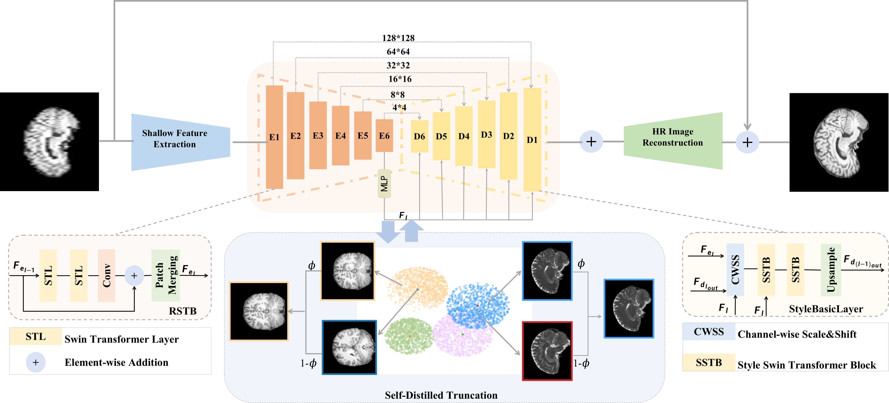
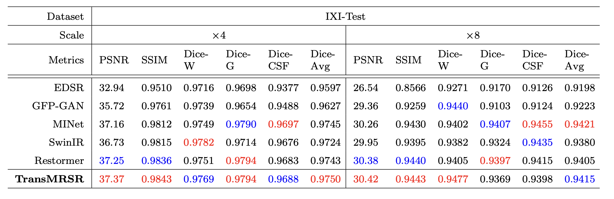

# TransMRSR: Transformer-based Self-Distilled Generative Prior for Brain MRI Super-Resolution

This repository is an official implementation of the paper Transformer-based Self-Distilled Generative Prior for Brain MRI Super-Resolution

## Introduction
TransMRSR a novel two-stage network for brain MRI SR based on the convolutional blocks to extract local information and transformer blocks to capture long-range dependencies. TransMRSR consists of three modules: the shallow local feature extraction, the deep non-local feature capture, and the HR image reconstruction. We perform a generative task to encapsulate diverse priors into a generative network (GAN), which is the decoder sub-module of the deep non-local feature capture part, in the first stage. The pre-trained GAN is used for the second stage of SR task. We further eliminate the potential latent space shift caused by the two-stage training strategy through the self-distilled truncation trick.



## Installation

run command line as following

```shell
   pip install -r requirements.txt
```

## Train

We implement all comparison models under the networks folder. For training, run command line as following

```shell
   python train_demo.py --scale 4 --dataset mri --model_type minet --batch_size 6 --net_G minet --resume outputs/minet_ixi_4_axial/checkpoints/best_63.pt --experiment_name minet_ixi_4_axial --target_modal t2 --data_root dataset/ixi/resample1 --pretrained_path ./pretrained/gfpgan_iter_495000.pth
```

## test

```shell
   python test_demo.py --scale 4 --dataset mri --model_type minet --batch_size 6 --net_G minet --resume outputs/minet_ixi_4_axial/checkpoints/best_63.pt --experiment_name minet_ixi_4_axial --target_modal t2 --data_root dataset/ixi/resample1 --pretrained_path ./pretrained/gfpgan_iter_495000.pth
```

--model_type: If the model is based on a reference image, select
--net_G:Select the SR model, there is MINet, SwinIR, Restormer, TransMRSR
--resume: resume from checkpoint
--target_modal: SR for different modal, support t1 and t2
--data_root: Data storage directory
--pretrained_path: required for GFP-GAN and TransMRSR

## Main Results




## Citation

